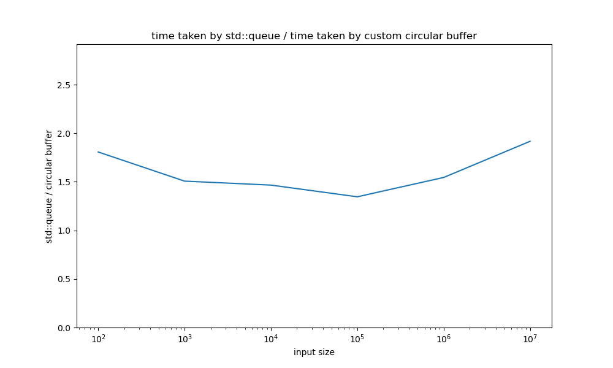

An experiment with writing a custom queue that is faster than std::queue. The custom queue is a circular buffer queue.

The custom queue is currently 1.5 - 2 times faster than std::queue.

# Files
- `benchmark.cpp` - Contains benchmarking code. Uses catch2's benchmarking functionality to measure how long push()/pop() operations take in std::queue and in the custom queue.
- `test.cpp` - Contains tests that verify basic functionality of the custom queue. Also produces an executable (i.e. has a main()) that *runs* both the tests and the benchmarks.
- `CircularBufferQueue.h/.tpp` - the custom queue class.
- `plot.py` - when ran, produces a plots comparing the runtimes of std::queue vs the custom queue
    - right now, you have to manually take the numbers that test.cpp outputs, put them in plot.py, and then run plot.py :/