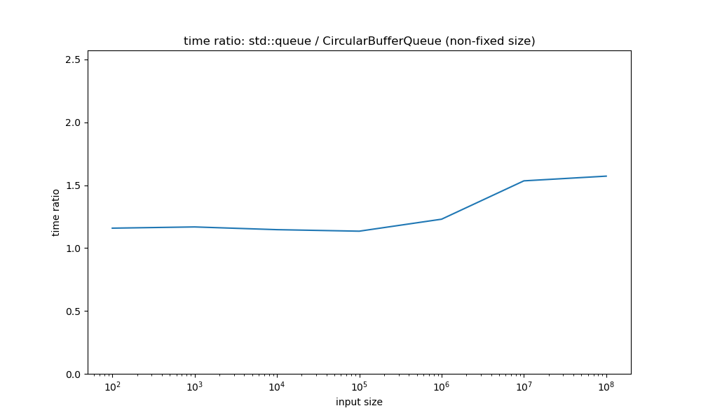

An experiment with writing a custom queue that is faster than std::queue. The custom queue is a circular buffer queue.

There are two versions of the custom queue. One is fixed size, the other can dynamically grow. The dynamically growable one is about **1.3 times** faster than std::queue. The fixed size one is about **1.5 times** faster than std::queue.

The fixed version is about **1.16 times** faster than the non-fixed version.

# Files
- `benchmark.cpp` - Contains benchmarking code. Uses catch2's benchmarking functionality to measure how long push()/peek()/pop() operations take in std::queue and in the custom queue(s).
- `test.cpp` - Contains tests that verify basic functionality of the custom queue(s). Also produces an executable (i.e. has a main()) that *runs* both the tests and the benchmarks.
- `CircularBufferQueue.h/.tpp` - the custom queue class. Is templated on the type of the elements in the queue, as well as the size of the queue (optional). If you specify a size, you get a fixed size queue, otherwise you get a dynamically growable one. 
- `plot.py` - when ran, produces plots comparing the runtimes of std::queue vs the custom queue(s)
    - right now, you have to manually take the numbers that test.cpp outputs, put them in plot.py, and then run plot.py :/